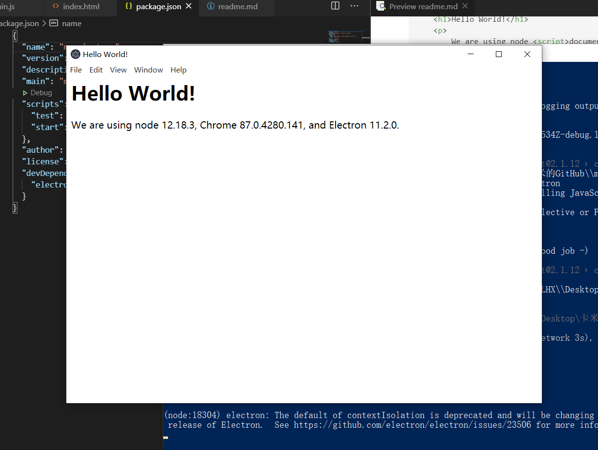

### electron 入门学习，手动搭建一个 electron 桌面应用
万事开头从 hell world 入门

- 首先初始化项目依赖
```
npm init
```
- 安装 electron
```
npm install --save-dev electron
```
- 创建主脚本文件
    主脚本指定了运行主进程的 Electron 应用程序的入口(就我们而言，是 main.js 文件)。 通常，在主进程中运行的脚本控制应用程序的生命周期、显示图形用户界面及其元素、执行本机操作系统交互以及在网页中创建渲染进程。 Electron 应用程序只能有一个主进程。

    主脚本可以如下所示：
    ```js
    //从 electron 包导入了 app 和 BrowserWindow 模块去管理应用程序的生命周期事件以及创建和控制浏览器窗口 
    const { app, BrowserWindow } = require('electron') 
    // 定义了一个创建 新的浏览窗口的函数并将 nodeIntegration 设置为 true，将 index.html 文件加载到窗口中
    function createWindow () {
    const win = new BrowserWindow({
        width: 800,
        height: 600,
        webPreferences: {
        nodeIntegration: true
        }
    })

    win.loadFile('index.html')
    }
    // 调用 createWindow方法，在 electron app 第一次被初始化时创建了一个新的窗口
    app.whenReady().then(createWindow)
    // 添加了一个新的侦听器，当应用程序不再有任何打开窗口时试图退出。 由于操作系统的 窗口管理行为 ，此监听器在 macOS 上是禁止操作的。
    app.on('window-all-closed', () => {
    if (process.platform !== 'darwin') {
        app.quit()
    }
    })
    // 添加一个新的侦听器，只有当应用程序激活后没有可见窗口时，才能创建新的浏览器窗口。 例如，在首次启动应用程序后或重启运行中的应用程序。
    app.on('activate', () => {
    if (BrowserWindow.getAllWindows().length === 0) {
        createWindow()
    }
    })
    ```
- 创建网页
这是应用程序初始化后您想要显示的页面。 此网页代表渲染过程。 您可以创建多个浏览器窗口，每个窗口都使用自己的独立渲染进程。 每个窗口都可以通过 `nodeIntegration` 选项完全访问 Node.js API。
index.html 页面如下所示：
    ```html
    <html>
    <head>
        <meta charset="UTF-8">
        <title>Hello World!</title>
        <meta http-equiv="Content-Security-Policy" content="script-src 'self' 'unsafe-inline';" />
    </head>
    <body style="background: white;">
        <h1>Hello World!</h1>
        <p>
            We are using node <script>document.write(process.versions.node)</script>,
            Chrome <script>document.write(process.versions.chrome)</script>,
            and Electron <script>document.write(process.versions.electron)</script>.
        </p>
    </body>
    </html>
    ```
- 修改 package.json 文件配置
  您的 Electron 应用程序使用 package.json 文件作为主入口(像任何其它的 Node.js 应用程序)。 您的应用程序的主脚本是 main.js，所以相应修改 package.json 文件：
  ```json
  {
  "name": "my-electron",
  "version": "1.0.0",
  "description": "- 万事开头从 hell world 入门",
  "main": "main.js",
  "scripts": {
    "test": "echo \"Error: no test specified\" && exit 1",
    "start": "electron ."
  },
  "author": "luohongxin",
  "license": "ISC"
  }
  ```
   注意：如果未设置 main 字段，Electron 将尝试加载包含在 package.json 文件目录中的 index.js 文件。`author` 和 `description` 字段对于打包来说是必要的，否则运行 `npm run make` 命令时会报错。
   默认情况下， npm start 命令将用 Node.js 来运行主脚本。 要使用 Electron 来运行脚本，您需要将其更改为这样：
   ```json
    {
    "name": "my-electron",
    "version": "1.0.0",
    "description": "- 万事开头从 hell world 入门",
    "main": "main.js",
    "scripts": {
        "test": "echo \"Error: no test specified\" && exit 1",
        "start": "electron ."
    },
    "author": "luohongxin",
    "license": "ISC"
    }
   ```
- 最后运行程序
```
npm start
```

